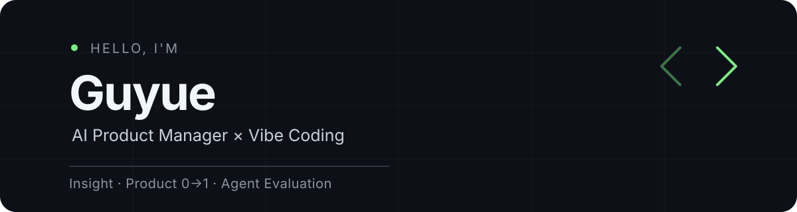

  

## 👋 About Me

AI 产品经理，关注 AI 产业生态与技术演进，具备 **AI Native 产品从需求洞察、方案设计、原型验证到评测迭代**的实践经验。

擅长 Vibe Coding，使用 Claude Code、Codex 等 Coding Agent 快速构建可交互 Demo，以最小成本验证产品假设；同时通过数据分析与指标体系，让产品迭代有据可依。

`需求洞察` · `AI 产品 0→1` · `Vibe Coding` · `Agent 评测与优化`

## 🚀 Featured Projects

<table>
  <tr>
    <td width="50%" valign="top">
      <h3>Video2Knowledge</h3>
      
<code>AI 知识管理</code> <code>音视频理解</code>

      
把音视频沉淀为可检索、可复用的知识资产。通过 ASR 与 LLM 完成章节划分、知识提取和内容生成，并保留可重新处理的阶段产物。

      
<a href="https://github.com/guyue356/Video2Knowledge">GitHub →</a>

    </td>
    <td width="50%" valign="top">
      <h3>SnapNote</h3>
      
<code>多模态笔记</code> <code>智能抽帧</code>

      
把长视频转成可检索、可回看的多模态图文笔记。将转写、关键画面、视觉语义与时间锚点对齐，让视频真正成为可复习的内容。

      
<a href="https://github.com/guyue356/SnapNote">GitHub →</a>

    </td>
  </tr>
  <tr>
    <td colspan="2" valign="top">
      <h3>prd-writer-skill</h3>
      
<code>Product Workflow</code> <code>Agent Skill</code>

      
用确认驱动的用户故事流程生成可落地 PRD。通过阶段确认、ASCII 线框图与 Mermaid 行为图，把模糊想法沉淀为开发和测试可直接对齐的需求文档。

      
<a href="https://github.com/guyue356/prd-writer-skill">GitHub →</a>

    </td>
  </tr>
</table>

## 🧩 Agent Skills

`PRD Writing` · `Video Understanding` · `Knowledge Extraction` · `Agent Evaluation` · `Workflow Design`

## 🛠 AI Stack

`Codex` · `Claude Code` · `Python` · `Next.js` · `FastAPI` · `Agent` · `ASR` · `VLM` · `LLM Eval`

## 🌱 Currently Exploring

- Harness Engineering
- AI Second Brain
- Multi-Agent Collaboration
- Agent Memory

## 📫 Connect

[Email](mailto:guyue0710@163.com) · [GitHub](https://github.com/guyue356) · [小红书](https://www.xiaohongshu.com/user/profile/5ebaad9a000000000101f919)
